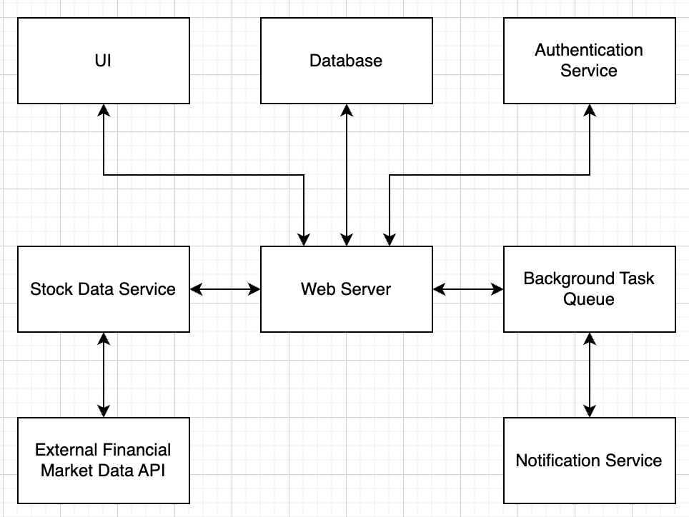

# COMS W3132 Individual Project

## Author

_Shreyash Sanjay Kawle - sk5109@columbia.edu_

## Project Title

_Market Navigator: A Real-Time Stock Screener and Analysis Platform_

## Project Description

Market Navigator is a project I'm interested in working on to bring together technology and the stock market, making it easier for people to find and analyze stocks with up-to-the-minute data. This tool aims to provide users with real-time updates on stock prices, along with detailed analysis based on fundamental and technical indicators. The goal is to create a platform that's easy for anyone to use, whether they're just starting with investing or have been doing it for years.

I decided to start this project because, as someone who's interested in both programming and investing, I noticed a lot of the stock tools out there are either too simple or too expensive for the average person. Market Navigator is meant to be a solution to that problem, offering deep insights into stocks without charging users a premium for access. It is also a project I have been wanting to work on for the past few semesters.

Over the next few weeks, I plan to build out the core features of Market Navigator. This includes setting up a backend system to gather and process stock information in real time, creating a way for users to filter stocks based on their own criteria like price movements or earnings ratios, and designing a clear and helpful interface where users can manage their picks and keep track of stocks they're interested in.

By working on Market Navigator, I hope to not only combine my interests in a meaningful way but also create something that can help others make informed decisions in their investing. It's all about making the wealth of stock market data out there more accessible and understandable for everyone.

## Set Up and Initialization

### Prerequisites

- Python 3.7 or higher
- Docker (optional, for containerized environments)
- An IDE such as Visual Studio Code or PyCharm
- Terminal access (command line interface)

### Installation Steps

1. **Clone the Repository**
   Clone the project repository to your local machine using:

```bash
git clone https://github.com/coms-w3132/final-project-SSK2822.git

```

2. **Set Up a Python Virtual Environment**
   It's recommended to use a virtual environment to manage dependencies:

```bash
python -m venv venv
source venv/bin/activate  # On Windows use `venv\Scripts\activate`
```

3. **Install Dependencies**
   Use pip method to install the required dependencies like pandas, numpy, redis, streamlit, alpha vantage, requests, yFinance.

```bash
pip install -r pandas numpy redis streamlit alpha_vantage requests yfinance
```

4. **Docker and Redis**
   Ensure Docker is installed and running. You can check if Docker is running by using:

```bash
docker ps
docker run --name my-redis -p 6379:6379 -d redis
```

This command pulls the Redis image from Docker Hub (if not already available), starts a Redis container named my-redis, and maps port 6379 from the container to port 6379 on your host machine.

Ensure cache_management.py has the below code:

```python
import redis
r = redis.Redis(host='localhost', port=6379, db=0)
```

5. **Running the App**
   To start the application, use the following Streamlit command:

```bash
streamlit run app.py
```

## How to Use the App

**Market Navigator** is designed to provide users with comprehensive financial data and analysis tools. Here’s how you can use the application:

1. **Select a Stock Symbol from the Magnificent 7**

   - Upon launching the app, you will see a dropdown menu at the top of the page.
   - Choose a stock symbol from the dropdown list (e.g., AAPL, TSLA, NVDA, GOOGL, MSFT, AMZN, META).

2. **View Fundamental and Technical Data**

   - After selecting a stock symbol, the app will display fundamental data such as EPS, Debt-to-Equity Ratio, P/E Ratio, etc., formatted for clarity.
   - Below the fundamental data, you will find technical analysis indicators like SMA, EMA, RSI, and others displayed in both table and graphical formats.

3. **Graph Visualization**

   - Use the dropdown menu to select a specific indicator to visualize.
   - The selected indicator will be displayed as a graph, providing a visual interpretation of the stock’s recent performance.

4. **Clear Cache**

   - If you need the latest information, use the "Clear Cache - Update to Latest Info" button. This will clear the cached data and fetch fresh data upon reselecting the stock ticker.

5. **Refresh Data**
   - If you want to refresh the data for any reason or if you suspect the data is outdated, simply reselect the stock symbol or use the provided controls to refresh the data.

This intuitive interface is designed to assist both novice and experienced investors in analyzing stock market trends and making informed investment decisions.

## Timeline

| Date (latest)     | Milestone                                                                               | Deliverables                | Git tag    |
| ----------------- | --------------------------------------------------------------------------------------- | --------------------------- | ---------- |
| **March&nbsp;29** | Submit project description                                                              | README.md                   | proposal   |
| **April&nbsp;5**  | Update project scope/direction based on instructor/TA feedback                          | README.md                   | approved   |
| **April&nbsp;19** | Core Functionality implementation and Data fetching and Processing                      | Source code, comments, docs | milestone1 |
| **April&nbsp;26** | Complete the backend along with Real time data intergration and start work on Front End | Source code, unit tests     | milestone2 |
| **May&nbsp;05**   | Completely (or partially) finished implementation                                       | Source code, documentation  | milestone3 |
| **May&nbsp;10**   | Final touches (conclusion, documentation, testing, etc.)                                | Conclusion (README.md)      | conclusion |

## Requirements, Features, and User Stories (Updated)

### 1. Real-Time Stock Data Fetching

- **User Story**: As an investor, I want to see the latest stock prices and data as soon as they're available, so I can make informed decisions based on the most current information.

### 2. Technical Analysis Tools

- **User Story**: As an investor, I need tools like moving averages and RSI charts, so I can analyze stock trends and make predictions based on technical indicators.

### 3. Fundamental Analysis Information

- **User Story**: As a beginner in investing, I want to learn about and use fundamental analysis metrics such as EPS (earnings per share) and debt-to-equity ratios to evaluate the health of a company..

## Technical Specification (Updated)

_Here's a high-level overview of the main components:_

### Data Processing and Visualization

- **Streamlit**: Serves as the primary tool for creating the web application, enabling rapid development of interactive, data-driven interfaces. It eliminates the need for separate frontend technologies by offering built-in capabilities for displaying charts, handling user inputs, and presenting data.

### Data Storage and Management

- **Redis**: Used for caching frequently accessed data and managing user sessions, ensuring quick response times and a smooth user experience. The Cahce Management stores the latest information in redis after which the user can decide to clear it to store the latest data automatically. Redis's fast in-memory datastore is ideal for the real-time aspects of Market Navigator, such as updating stock prices and alerting users about significant market movements.

### Data Fetching and Analysis

- **Alpha Vantage and yFinance**: These provide access to real-time and historical stock data. They were chosen for their comprehensive data offerings and generous free tiers, which are suitable for a portfolio project. Also yFinance acts as a backup API call when Alpha Vantages reaches limit (keeping the user expereince seemless). Alpha Vantage is given the prioirty because it has more accurate information and faster data restrival speeds than yFinance.
- **Pandas**: Python library for data manipulation and analysis, perfect for processing stock data, calculating indicators, and preparing data for presentation or further analysis.

## System or Software Architecture Diagram

For the ideal project scope beyond the course evauation requirement (Discussed with Prof.



## Development Methodology

To keep the development of Market Navigator well-organized and on track, I plan to incorporate a mix of external tools and practices that best suit the workflow and project management needs. Notion and GitHub will be central to this approach, each serving distinct purposes to enhance productivity and collaboration.

### Notion for Project Management

- **Project Board**: I will use Notion to create a project board similar to a kanban board. This board will help in visualizing the project's workflow, categorizing tasks into columns like "Planned," "In Progress," and "Completed." Notion's flexibility in customization allows for a detailed overview of each task, including deadlines, priority levels, and related documentation.
- **Issue Tracking**: Although GitHub Issues is an excellent tool for tracking bugs and feature requests directly related to code, I'll leverage Notion for a broader range of project issues and ideas. This can include design decisions, research notes, and non-code-related tasks. The ability to link these issues to specific project tasks or documents within Notion provides a comprehensive view of the project's facets.

### GitHub for Code Management and Collaboration

- **Pull Requests and Code Review**: GitHub pull requests will be the standard method for merging new code into the `develop` and `main` branches. This process will include peer reviews to maintain high code quality and adherence to project standards.
- **GitHub Actions for CI/CD**: Automated workflows using GitHub Actions will facilitate continuous integration and deployment. This includes running tests, linting code, and deploying updates to the production environment, ensuring a seamless and consistent development cycle.

## Testing and Evaluation

### Testing Framework

We utilized Python's `unittest` framework to create a suite of automated tests. This framework helps in building test cases by providing a rich set of tools for asserting conditions and managing test structure.

### Types of Tests

#### 1. Data Fetching Tests

Tests in the `data_fetching` module ensure that our application correctly handles data retrieval, error management, and data caching:

- **Format Validation**: We verify that the data fetched from external APIs or internal cache mechanisms adheres to expected formats. For example, we ensure that historical stock data is returned as a dictionary with expected keys.
- **Error Handling**: Tests check the application's response to unsupported ticker inputs, confirming that appropriate exceptions are thrown.
- **Cache Integration**: We validate that data retrieved from the cache is formatted correctly and logged properly using Streamlit, enhancing debuggability and traceability.

#### 2. Data Processing Tests

The `data_processing` module is tested to confirm the correctness of financial calculations and data transformations:

- **Calculations**: Functions like calculating all-time highs (ATH), moving averages (EMA, SMA), and other financial indicators (ATR, ROC, RSI) are tested against predefined outputs to ensure their accuracy.
- **Data Integrity**: We confirm that transformations maintain data integrity, testing functions that manipulate pandas DataFrames directly.
- **Performance Metrics**: The tests also cover performance metrics, ensuring that calculations are not only correct but also performant under different data volumes.

### Test Setup and Execution

Each test is setup using a sample DataFrame generated with random data, which simulates real-world stock market data. This setup is used across various test cases to ensure consistent and reliable test results. Here's a breakdown of specific tests conducted:

- **High and Low Values**: Functions that calculate the highest and lowest values in the data series are checked for maximum and minimum calculations.
- **Moving Averages and Related Metrics**: Tests for EMA and SMA ensure these averages are computed correctly over different spans and windows.
- **Volatility and Rate of Change**: ATR and ROC calculations are validated to ensure they correctly reflect the data's volatility and price changes over specified periods.
- **Trend and Profit/Loss Calculations**: RSI and profit/loss percentage calculations are tested for accuracy in identifying market trends and potential trading insights.

## Potential Challenges and Roadblocks

- **Learning Curve for New Technologies**: As the project involves technologies I'm less familiar with, the initial learning phase could slow progress.
- _Solution_: Allocate specific times for learning and experimentation. Utilize online resources, and don't hesitate to seek help from more experienced peers or TAs.
- **Integration of Real-Time Data**: Ensuring smooth, real-time data updates could present technical challenges.
- _Solution_: Start with a basic implementation and incrementally add complexity. Consider open-source examples and documentation for guidance.
- **Maintaining Project Scope**: There's a risk of scope creep, where additional features extend beyond the original plan, impacting timelines.
- _Solution_: Regularly review project goals and timelines, prioritizing tasks and being willing to defer lower-priority features.

## Conclusion and Future Work

In wrapping up the development of Market Navigator, I'm thrilled with the outcome. This project not only brought together my interests in software development and finance but also provided a valuable learning experience in real-world application development. The core functionalities deliver on the promise of providing individual investors with a reliable and insightful stock analysis tool.

Streamlit played a significant role in streamlining the development process. Its capabilities for creating interactive interfaces and handling data visualization significantly reduced the time and effort required to build the application's front-end. This allowed me to focus on the core functionalities and data analysis aspects of Market Navigator.

### Future Work

Looking beyond the initial scope, there are several areas for potential expansion:

- **Advanced Data Analytics**: Incorporating machine learning for predictive analysis and trend identification could offer users deeper insights.
- **Mobile App Development**: Expanding Market Navigator into a mobile application could greatly increase accessibility and user engagement.
- **Community Features**: Implementing forums or shared investment strategies could foster a community of users, enhancing the tool's value through shared knowledge.

By continuing to develop these functionalities, Market Navigator has the potential to become a comprehensive and valuable resource for investors of all experience levels.

### Lessons Learned

This project was an invaluable experience that solidified my interest in applying software development to the financial domain. Throughout the development process, I encountered a number of challenges that helped me refine my problem-solving skills and technical expertise.

One of the biggest takeaways was the importance of using the right tools for the job. Streamlit's capabilities proved to be a perfect fit for this project, allowing for rapid prototyping and efficient UI development.

I also learned the value of well-defined milestones and a structured development approach. Following a development methodology like the one outlined earlier helped me stay organized and ensured I met project deadlines.

Looking back, there are a few areas where I could have improved. Spending more time upfront on detailed system architecture planning could have helped avoid some minor roadblocks encountered during development. Additionally, incorporating unit testing from the very beginning would have ensured better code quality throughout the development lifecycle.

Overall, this project was a rewarding experience that provided me with a strong foundation for future endeavors in combining finance and software development. I am confident that the lessons learned here will be instrumental in my academic and professional pursuits.
